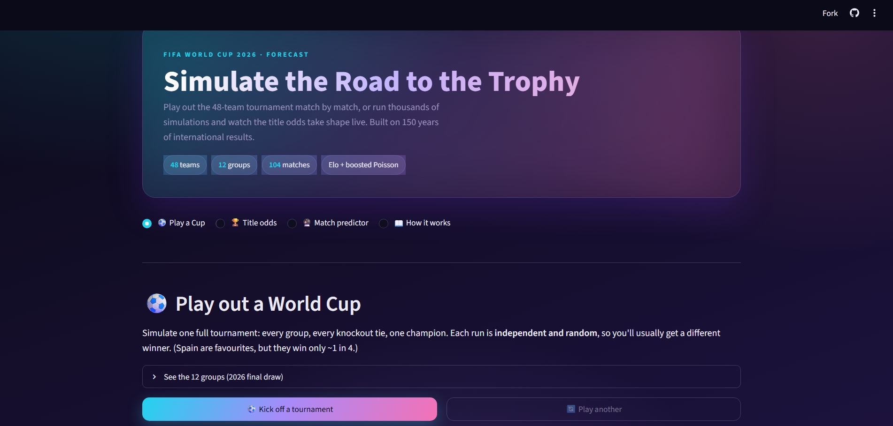

# ⚽ 2026 World Cup Forecasting

A probabilistic forecasting engine for the 2026 FIFA World Cup, built from 150
years of international results. It rates every national team with a
chronological Elo system, turns each matchup into a distribution over scorelines
with a Poisson goals model, and simulates the full 48-team tournament tens of
thousands of times to produce honest, calibrated probabilities, title odds,
group-qualification chances, and head-to-head match forecasts, all explorable
in an interactive Streamlit app.


<!-- Add a screenshot of the running app at docs/screenshot.png -->

---

## Methodology

The pipeline runs **Elo → features → Poisson goals model → Monte Carlo**.

### 1. Elo ratings ([`src/elo.py`](src/elo.py))

Every team starts at 1500 and is updated after each match, processed in
chronological order over the entire history. Each update is:

- scaled by the **margin of victory** (log-dampened, so a 5–0 counts more than a
  1–0 but with diminishing returns);
- weighted by **match importance** `K` parsed from the competition (friendlies
  move ratings least, continental finals and the World Cup most);
- adjusted for **home advantage**, added to the home side's effective rating
  unless the match is on neutral ground.

Ratings are strictly **point-in-time**: a rating only ever reflects matches
played *before* the game in question, so there is no look-ahead.

### 2. Match features ([`src/features.py`](src/features.py))

For each match we build a leak-free feature vector from the state *before*
kick-off: both teams' Elo and their difference, recent scoring/conceding form
(rolling average over each side's last 10 matches), a neutral-venue flag, and
the competition tier. State accumulates over all history, but only matches from
2002 onward become training rows, so ratings and form have no cold start.

### 3. Poisson goals model ([`src/model.py`](src/model.py))

Two models predict each side's **expected goals**, which define a scoreline
distribution (and hence win/draw/win and exact-score probabilities):

- **Gradient-boosted Poisson**, two `HistGradientBoostingRegressor(loss="poisson")`
  models over the engineered features. **This is the selected model.**
- **Dixon-Coles bivariate Poisson**, an interpretable baseline with per-team
  attack/defence strengths, a home term, and a low-score correlation correction.

Model selection is by **Ranked Probability Score (RPS)** on a time-based
holdout. RPS is the right headline metric because match results are *ordered*
(a win is closer to a draw than to a loss), and RPS rewards probability mass
placed near the true outcome, unlike log-loss or Brier, which treat the three
outcomes as unordered.

### 4. Monte Carlo tournament ([`src/simulate.py`](src/simulate.py))

The 48-team bracket is simulated many times. Each run plays all group matches,
ranks groups by the **FIFA 2026 tiebreakers in order** (points → goal difference
→ goals scored → head-to-head → drawing of lots), advances the top two plus the
**eight best third-placed teams**, then runs the knockout rounds (R32 → R16 →
QF → SF → final) with extra time and Elo-weighted penalty shootouts. The three
co-hosts (**USA, Canada, Mexico**) play at **home**; every other match is
**neutral**. Results are aggregated into per-team probabilities of advancing,
reaching each round, and winning.

**A single tournament is high-variance, and that's the point.** Football is
noisy: a knockout tie is close to a coin flip between well-matched sides, and a
champion has to win seven in a row, so even the favourite wins only about one
time in four and a mid-ranked nation occasionally goes all the way (just as real
World Cups produce surprise runs). The *Play a Cup* page shows one such possible
world; the *Title odds* page averages thousands of them into the calibrated
long-run picture. Neither is "wrong", they answer different questions.

---

## Backtest (out-of-time)

Models are trained on matches **before 2022** and scored on the unseen **2022+**
holdout (which includes the 2022 World Cup), never a random split, which would
let a model train on matches that occurred *after* those it is asked to predict.

| Model | RPS ↓ | Log-loss ↓ | Brier ↓ |
| --- | --- | --- | --- |
| **Gradient-boosted Poisson** (selected) | **0.1721** | **0.8804** | **0.5161** |
| Dixon-Coles bivariate Poisson (baseline) | 0.1764 | 0.8962 | 0.5236 |

Train: 18,703 matches (2002–2021) · Holdout: 4,421 matches (2022+). The selected
model is well calibrated on the holdout, its predicted home-win probabilities
track observed frequencies closely (expected calibration error ≈ 0.024).

Reproduce with:

```bash
python -c "from src import model; model.evaluate_and_compare()"
```

---

## Limitations & honesty

This is a **statistical model, not a crystal ball.** Read the numbers as
probabilities, not predictions.

- **It outputs probabilities.** A 25% favourite still loses three times out of
  four; a 2% long shot will sometimes win. Nothing here is a guarantee.
- **Squad-level reality is not modelled.** Injuries, suspensions, transfers,
  managerial changes, fatigue, travel, and tactical matchups are all invisible
  to the model, it sees only historical results.
- **"Form" is a crude proxy.** Recent scoring/conceding over 10 matches cannot
  capture *why* a team is in form, and international form data is sparse and
  noisy (long gaps, low-stakes friendlies).
- **Strength drifts.** A team's true level is never observed directly and
  changes between tournaments; Elo is a lagged estimate.
- **Simplifying assumptions.** Only the three co-hosts get home advantage (every
  other tie is neutral, including host-vs-host), and the Round-of-32 bracket
  pairings should be confirmed against FIFA's official 2026 bracket (the default
  layout is structurally valid but not guaranteed to match official slotting).

Treat the output as a **well-calibrated starting point** for discussion, not as
certainty.

---

## Setup

Requires **Python 3.11+** (developed and tested on 3.12).

```bash
# 1. Create and activate a virtual environment
python -m venv .venv
.venv\Scripts\Activate.ps1        # Windows PowerShell
# source .venv/bin/activate        # macOS / Linux

# 2. Install dependencies
pip install -r requirements.txt
```

## Usage

```bash
# Download data, build features, train & compare both models, save the best.
# (Use this import form rather than `python -m src.model` so the saved model
#  unpickles correctly from any context, including the app and tests.)
python -c "from src import model; model.evaluate_and_compare()"

# (Optional) compute and save current Elo ratings, printing the top 25 teams.
python -m src.elo

# Fill the official groups in config.WORLD_CUP_GROUPS, then simulate the
# tournament and cache per-team probabilities.
python -c "from src import simulate; simulate.run_monte_carlo(10000)"

# Launch the interactive app.
streamlit run app.py

# Run the test suite.
pytest
```

The app is simulation-driven, nothing is shown pre-computed. Four pages
(sidebar nav):

- **Play a Cup**, play out one full tournament with an animated reveal, a
  knockout bracket with every scoreline, group tables, and the race for the
  best third-placed teams. Each run is independent, so the champion varies.
- **Title odds**, run thousands of tournaments and watch the championship
  probabilities converge **live**, then explore a leaderboard / 3D podium / table.
- **Match predictor**, head-to-head W/D/W, expected goals, and a scoreline heatmap.
- **How it works**, methodology, the time-based backtest, and uncertainty notes.


---

## Project structure

```
src/
  config.py     paths, model/Elo parameters, the 2026 group & bracket structure
  data.py       download/cache, cleaning, and team-name normalisation
  elo.py        chronological Elo engine
  features.py   leak-free per-match feature builder
  model.py      Poisson goals models, metrics, time-based backtest
  simulate.py   match, knockout, and full-tournament Monte Carlo
tests/          pytest suite
app.py          Streamlit entry point
data/           cached CSVs and Monte Carlo output (gitignored)
models/         saved model and current Elo ratings (gitignored)
notebooks/      backtest write-up
```

---

## Data & attribution

All match data comes from the **[martj42/international_results](https://github.com/martj42/international_results)**
dataset, a comprehensive, community-maintained record of men's international
football results, used under its license. Full credit and thanks to
[@martj42](https://github.com/martj42) and contributors for maintaining it. This
project simply caches and analyses that data; it claims no ownership of it.

## License

Released under the MIT License, see [LICENSE](LICENSE).
